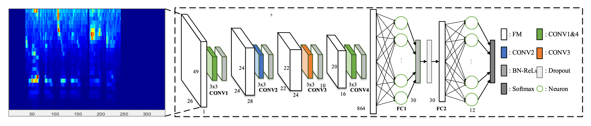
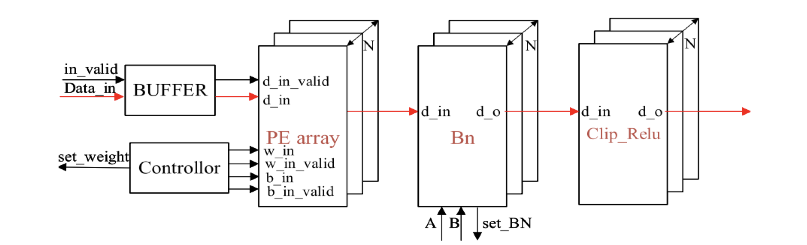
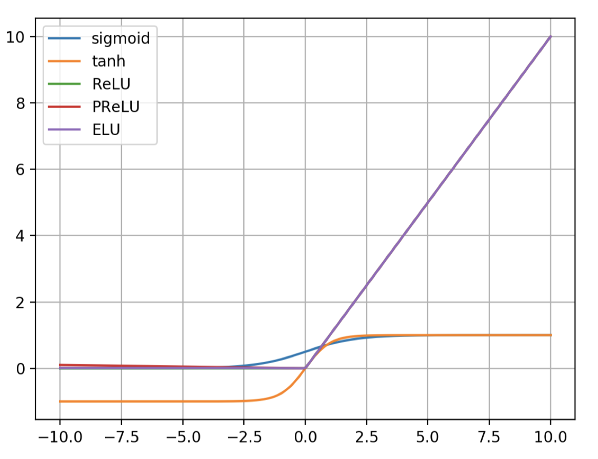
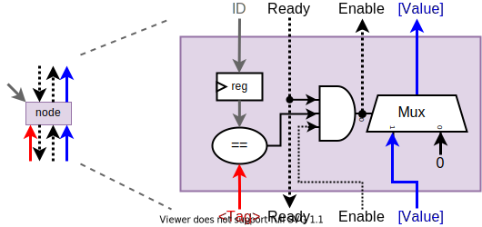
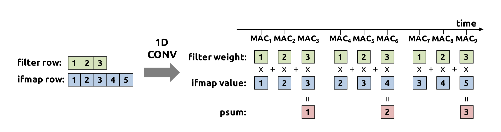
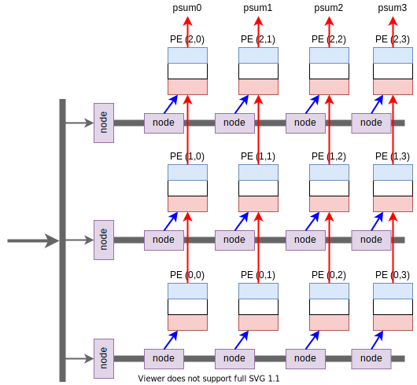
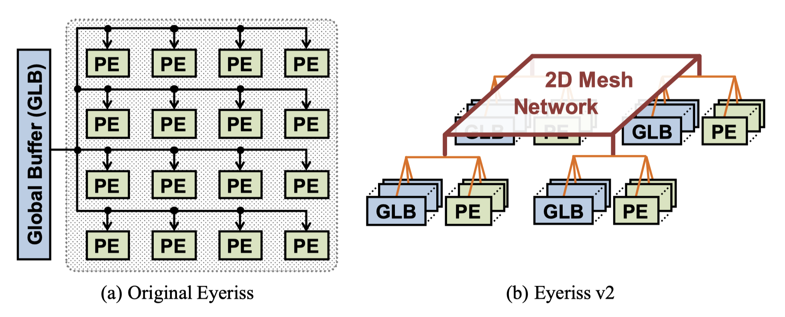

# 引言

本题给出一个基于CNN（卷积神经网络）的语音关键词识别网络，网络结构如下：

| Layer       | Conv1    | Conv2    | Conv3    | Conv4  | FC1  | FC2  |
| ----------- | -------- | -------- | -------- | ------ | ---- | ---- |
| Input       | 26x49x1  | /        | /        | /      | /    | /    |
| Output      | 24x24x28 | 22x22x24 | 10x20x16 | 8x9x12 | 30   | 12   |
| Kernel Size | 3x3x8    | 3x3x24   | 3x3x16   | 3x3x12 | 30   | 12   |
| Stride      | (1,2)    | (1,1)    | (2,1)    | (1,2)  | /    | /    |

要求使用 Matlab 和 Verilog 复现第一层和第二层卷积的正向过程，并完成相应的仿真。

使用 Verilog 实现的部分给了一个参考的结构，如下：

可以看到，不同层的卷积只是输入输出的尺寸不同，但是运算是一样的，因此不同层的卷积可以复用同一个计算单元。

进一步拓展，不同结构的网络，其使用的算子也基本上是固定的，包含：卷积（conv）、激活（actv）、池化（pooling）、全连接（FC），因此可以设计一个通用的加速器，通过软件的控制来实现对不同结构的卷积神经网络加速的效果。

# 原理介绍

## 适用于 PE 单元的一维卷积

一维卷积的实现过程如上图所示，其相当于将卷积运算中的一行单独取出来运算。这种运算方法比较适合用硬件来实现。

## Chisel 介绍

本次设计使用的是 chisel，相对于 verilog，使用 chisel 可以大幅提高开发效率。

Chisel（Constructing Hardware In a Scala Embedded Language）是 UC Berkeley 开发的一种开源硬件构造语言。它是建构在 Scala 语言之上的领域专用语言（DSL），支持高度参数化的硬件生成器。

- 内嵌Scala编程语言；
- 层次化+面向对象+功能构建；
- 使用Scala中的元编程可以高度地参数化；
- 支持专用设计语言的分层；
- 生成低级Verilog设计文件，传递到标准ASIC或FPGA工具。

目前，有多个开源项目使用 Chisel 作为开发语言，包括采用 RISC-V 架构的开源标量处理器Rocket、开源乱序执行处理器BOOM（Berkeley Out‐of‐Order Machine ）以及中科院最近发布国产 RISC-V 处理器“香山”。

# 行为级仿真

行为级仿真使用 MATLAB 实现（MATLAB 真的是臃肿，要不是作业要求，这一步就用 Python 做了）。

## 卷积 (Convolution) 运算

卷积层 (Convolution Layer) 的本质是输入图像与权重矩阵的乘积累加运算 (Multiply Accumulate, MAC)。

卷积运算输出的矩阵大小计算公式如下：
$$
O = (I - K + 2*P)/S + 1;
$$
其中 $O$ 为卷积输出矩阵的大小，$I$ 为卷积输入矩阵的大小，$K$ 为卷积核的大小，$P$ 为边界填充的像素数量，$S$ 为步长。

关键部分代码：

**conv**

~~~matlab
 conv
for mm = 1:M % M: 输出通道数量
  for rr = 1:V_O % V_O: 输出矩阵垂直方向的长度
    for cc = 1:H_O % H_O: 输出矩阵水平方向的长度
      tmp = 0; 
      for nn = 1:N % N: 输入通道数量
        for ii = 1:K % K: 卷积核大小
          for jj = 1:K
            ri = (rr-1)*S_V+1-P_V; % P_V: 垂直方向的填充, S_V: 垂直方向的步长
            ci = (cc-1)*S_H+1-P_H; % P_H: 水平方向的填充, S_H: 水平方向的步长
            rii = int32(ri+ii-1);
            cii = int32(ci+jj-1);

            if (cii == 0 || cii > H) || (rii == 0 || rii > V)
              img_data = 0;
            else
              img_data = img(rii, cii, nn);
            end

            tmp = tmp + img_data * weight(ii, jj, nn, mm);
          end
        end
      end
      feature(rr, cc, mm) = tmp + bias(1 ,1 , mm);
    end
  end
end
~~~

## Batch Normalization (BN) 运算

Batch Normalization 的原理不做过多介绍，这里介绍一下其算法实现的过程。

关于神经网络中的 BN 层，标准算法如下：

首先，我们需要求得mini-batch里元素的均值：
$$
\mu_B = \frac{1}{m} {\sum\limits^m_{i=1}} x_i
$$
接下来，求取mini-batch的方差：
$$
\sigma _B ^2 =\frac{1}{m} {\sum\limits^m_{i=1}} (x_i-\mu_B)^2
$$
这样我们就可以对每个元素进行归一化：
$$
\hat{x_i} = \frac{x_i-\mu_B}{\sqrt{\sigma^2_B + \epsilon}}
$$
最后进行尺度缩放和偏移操作，这样可以变换回原始的分布，实现恒等变换，这样的目的是为了补偿网络的非线性表达能力，因为经过标准化之后，偏移量丢失。具体的表达如下，$y_i$ 就是网络的最终输出。
$$
y_i = \gamma \hat{x_i} + \beta = \rm{BN}_{\gamma ,\beta}(x_i)
$$
题目中提供的 scale 和 offset 做了预处理：
$$
\rm{scale} = \frac{\gamma}{\sqrt{\sigma^2_B + \epsilon}}
$$

$$
\rm{offset} = \beta - \frac{\gamma \times \mu_B}{\sqrt{\sigma^2_B + \epsilon}}
$$

因此，BN 操作可以变为：
$$
y_i=\rm{BN}_{\gamma ,\beta}(x_i)=\rm{scale}\times x_i + \rm{offset}
$$

> batch normalization 依赖于 batch 的大小，当 batch 值很小时，计算的均值和方差不稳定。研究表明对于ResNet类模型在ImageNet数据集上，batch从16降低到8时开始有非常明显的性能下降[6]。

关键部分代码：

**BN**

~~~matlab
for nn = 1:N
  for rr = 1:V
    for cc = 1:H
      feature(rr, cc, nn) = img(rr, cc, nn)*scale_i(1,1,nn)+offset_i(1,1,nn);
    end
  end
end
~~~

## 激活 (Activation) 运算

激活函数 (Activation Function) 是非线性单元，它的存在给深度神经网络体系增加了非线性元素，是深度神经网络能够拟合任意函数的基础。比较重要且常用的激活函数有 ReLU、Sigmoid 和 Tanh 。此外，其余常用的激活函数还有 PReLU, ELU 等，他们的函数图像与取值范围如下图所示：

题目中要求使用的激活函数为一种改进型 ReLU，称为 Bounded ReLU (bReLU)，可以描述为：
$$
f(x)=\begin{cases}
1, & x\geq 1 \\
x, & 0 \leq x < 1 \\
0, & x < 0
\end{cases}
$$
关键代码：

**ReLU**

~~~matlab
for nn = 1:N
  for rr = 1:V
    for cc = 1:H
      if img(rr, cc, nn) < 0
        feature(rr, cc, nn) = 0;
      else
        feature(rr, cc, nn) = img(rr, cc, nn);
      end
    end
  end
end
feature = sfi(feature, 16, 15);
~~~

## 其他算子

在卷积神经网络中，还会用到池化层和激活层，由于题目要求比较简单，没有使用到，这里就不做介绍了。

# 设计结构

PE 阵列主要由广播结构、buffer 和 PE 单元组成。

## 广播结构设计

在PE 阵列中，由于 PE 单元的数量很多，使用全局广播需要消耗大量的资源，因此对广播的方式做了特殊的设计。其结构如下图所示：

从 Global BUffer 出来的数据经过 M 个节点向 M 行广播，每一行的数据经过 N 个节点向 N 列广播。单个节点的结构如下图所示：

每个节点的会将 ID 和 Tag 进行对比，只有 Tag 和 ID 一致，数据才可以通行。每个节点的 ID 都是可以配置的，Tag 数据是从总线的数据流中获取的。

## PE 单元结构设计

单个的 PE 计算单元需要实现一维卷积运算，也就是说单个的 PE 计算单元可以实现输入图像中的一行数据（包含所有的通道）与卷积核中的一行数据进行卷积运算，最终可以得到输出图像中的一行数据（包含所有通道）。卷积的过程可以用下图来表示：

上图是卷积核宽度 (col) 为 3，输入图像宽度为 5 的一维卷积运算的过程。可以看到卷积核和输入图像的数据会在计算中反复使用到，每计算一个输出数据，使用的卷积核的数据是相同的，而使用的输入图像的数据会每次移动一个步长，因此在设计 PE 单元的时候需要设计一个**循环 buffer** 的结构用来暂存数据。同时考虑到输入通道和输出通道通常都不是单通道，因此 PE 单元中需要一块 RAM 用来存放每个输出通道的部分和。最终设计的 PE 单元结构如下图所示。

PE 单元的设计分为 3 层，最里层 *PE Core* 的逻辑可以实现单个输出数据的计算，其中 *Paratial Sum* 是用来暂存部分和的 RAM，*PE Core* 包含一个 16bit 的乘法器和一个 64bit 的加法器，用以实现乘加运算。*PE Core* 的输入除了图像数据 (ifmaps) 和权重数据 (filters) 之外，还有一个部分和 (psum) 的输入接口，这样可以将多个 PE 单元串联起来，实现多行数据的累加。在数据位宽的设计上，输入图像数据和权重数据都是 16bit，输入输出的部分和是 64bit，用来避免多次累加后数据溢出。同时，权重数据和输入的图像数据在使用之前应该先进行软件仿真，选择合适的量化位宽，以避免数据溢出。

中间层 *PE* 实现了前一小节提到的循环 buffer 的结构，其中权重数据的 buffer (filters loop buffer) 实现比较简单，只需要在 *PE Core* 计算时，将 buffer 的输出送到 buffer 的输入。输入图像数据的 Buffer (ifmaps loop buffer) 结构和权重数据的 buffer 类似，但需要考虑到卷积水平方向上的步长 (stepW)，每次卷积核滑动，需要丢弃掉 stepW 个数据，同时从外部再获取 stepW 个新数据，这个过程通过图中的 *if trash* 逻辑来控制。

最外层的 *PE Top* 相当于在中间层的基础上在输入加了 FIFO，用来缓存循环 Buffer 暂时没有使用到的数据。

## Buffer 设计

在上一节提到，PE 中加入了 buffer，以用来缓存待计算的数据，两种 buffer 都是用 FIFO 的结构实现的，外加一些控制逻辑，来控制 fifo 的输入和输出。因此需要提前计算好 FIFO 的深度，以满足设计网络的要求。

在所有的卷积计算中，第二层卷积需要的数据更多，因此用第二层卷积计算 fifo 的深度。

首先计算内层的 ifmaps loop buffer，该 buffer 需要获取的数据量为 $卷积核宽度 \times 输入图像通道数$，因此其最小的深度为 84，设置为 256。

计算 filters loop buffer，该 buffer 需要获取的数据量为 $卷积核宽度\times 输入通道数 \times 输出通道数$，因此其最小深度为 2016，设置为 2048。

外层的 buffer 结构比较简单，就是普通的 fifo，其深度设置为 2048。

## 脉动阵列结构设计

在将单个的 PE 单元组合成 PE 阵列时，第一行 PE 单元的三种输入数据 (ifmaps, filters, psum) 都由 *Node* 提供，后面的每一行的 ifmaps 和 filters 由 *Node* 提供，而 psum 输入来自前一行 PE 的 psum 输出，最后一行 PE 的 psum 输出是整个阵列的输出。下图是一个 3 行 4 列的阵列结构。

实际设计过程中，考虑到第一层的输出是最大的，因此 PE 阵列的大小按照第一层来设计，设置为 3 行 24 列。

# 测试与调试

由于测试需要大量的数据，产生的结果也很多，通过看波形图来验证的方法几乎是不可行的。由于本设计是使用 chisel 实现的，chisel 比较方便的一点是 chisel 是基于 scala 语言实现的，因此使用 scala 实现了一个行为级仿真的模型（其功能和之前的 Matlab 实现的是相同的），对行为级模型和 chisel 的设计输入相同的激励（即图像和权重数据），对比两者的输入，如果一致就说明 chisel 的设计是正确的。

测试给的激励是随机产生的，通过多次测试后，行为级模型和 chisel 的设计始终有相同的输出结果，证明设计是正确的。

# 改进方向

## 将大的 PE 阵列拆分成多个小的阵列

目前是使用一个大的 PE 阵列来实现卷积运算的，为了保证运算的成功，PE 阵列的尺寸需要按照最大的那一层来设计，当进行其他卷积层运算的时候，可能利用率就会比较低；同时 PE 整列的尺寸固定，导致了其灵活性较低，如果卷积层的尺寸超过了设计的 PE 阵列，就不适用了。因此可以考虑将一个大的 PE 阵列拆分成多个小的 PE 阵列，加上额外的控制逻辑，来提高阵列的使用效率和灵活性。事实上，在本设计参考之一 Eyeriss 在其第二版的设计里就使用的是这个思路，其改进如下图所示。

目前的设计其实已经预留了接口，通过阵列第一行的 psum 接口，来输入部分和，因此可以将多个 PE 阵列组合。不过为了灵活性的考虑，这部分的控制逻辑更适合用 CPU 来实现。

## 其他算子的实现

目前只实现了卷积运算和激活运算，并且激活运算只有 relu 一种，后面可以添加池化运算，全连接层等。

# 参考文献

[1] https://docs.nvidia.com/gpudirect-storage/design-guide/index.html

[2] http://on-demand.gputechconf.com/gtc/2017/presentation/s7310-8-bit-inference-with-tensorrt.pdf

[3] SHEN H, GONG J, LIU X, et al. HIGHLY EFFICIENT 8-BIT LOW PRECISION INFERENCE OF CONVOLUTIONAL NEURAL NETWORKS[EB/OL]. 2019. https://openreview.net/forum?id=SklzIjActX.

[4] JOUPPI N P, YOUNG C, PATIL N, et al. In-datacenter performance analysis of a tensor processing unit [J/OL]. CoRR, 2017, abs/1704.04760. http://arxiv.org/abs/1704.04760.

[5] CHEN T, DU Z, SUN N, et al. Diannao: A small-footprint high-throughput accelerator for ubiquitous machine-learning[J/OL]. SIGARCH Comput. Archit. News, 2014, 42(1):269–284. https://doi.org/10. 1145/2654822.2541967.

[6] Jonathan Frankle, David J. Schwab, Ari S. Morcos: “Training BatchNorm and Only BatchNorm: On the Expressive Power of Random Features in CNNs”, 2020; [http://arxiv.org/abs/2003.00152 arXiv:2003.00152].

[7] Y.-H. Chen, J. Emer, and V. Sze, “Eyeriss: A Spatial Architecture for Energy-Efficient Dataflow for Convolutional Neural Networks,” in *2016 ACM/IEEE 43rd Annual International Symposium on Computer Architecture (ISCA)*, 2016, pp. 367–379.

[8] Y.-H. Chen, T. Krishna, J. S. Emer, and V. Sze, “Eyeriss: An energy-efficient reconfigurable accelerator for deep convolutional neural networks,” *IEEE J. Solid-State Circuits*, vol. 52, no. 1, pp. 127–138, 2016.

[9] Y.-H. Chen, T.-J. Yang, J. Emer, and V. Sze, “Eyeriss v2: A Flexible Accelerator for Emerging Deep Neural Networks on Mobile Devices,” *arXiv Prepr. arXiv1807.07928*, 2018.

[10] https://www.chisel-lang.org/

# 附录A：附件包含内容

附件结构如下：

~~~bash
.
├── build.sbt              # 编译脚本
├── build.sc
├── LICENSE
├── paper                  # 设计报告
│   ├── report.docx
│   └── report.md
├── pic
├── README.md
├── src                    # 代码 
│   ├── main
│   │   ├── resources      # verilog 代码
│   │   └── scala
│   │       ├── adder
│   │       ├── myutil
│   │       └── sonn       # 主要 chisel 代码
│   └── test
│       └── scala
│           ├── adder
│           ├── myutil
│           ├── simulator
│           └── sonn       # 测试代码
└── test_run_dir
    └── PEArray						 # chisel 生成的 verilog 代码
~~~

# 附录B：代码使用方法

代码使用方法见附件 *README.md*。

